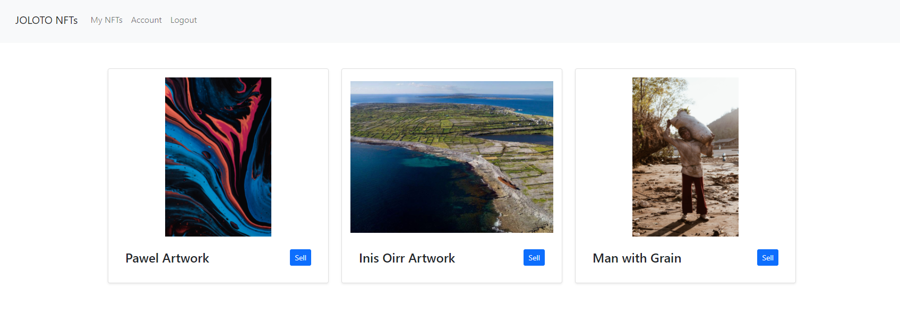
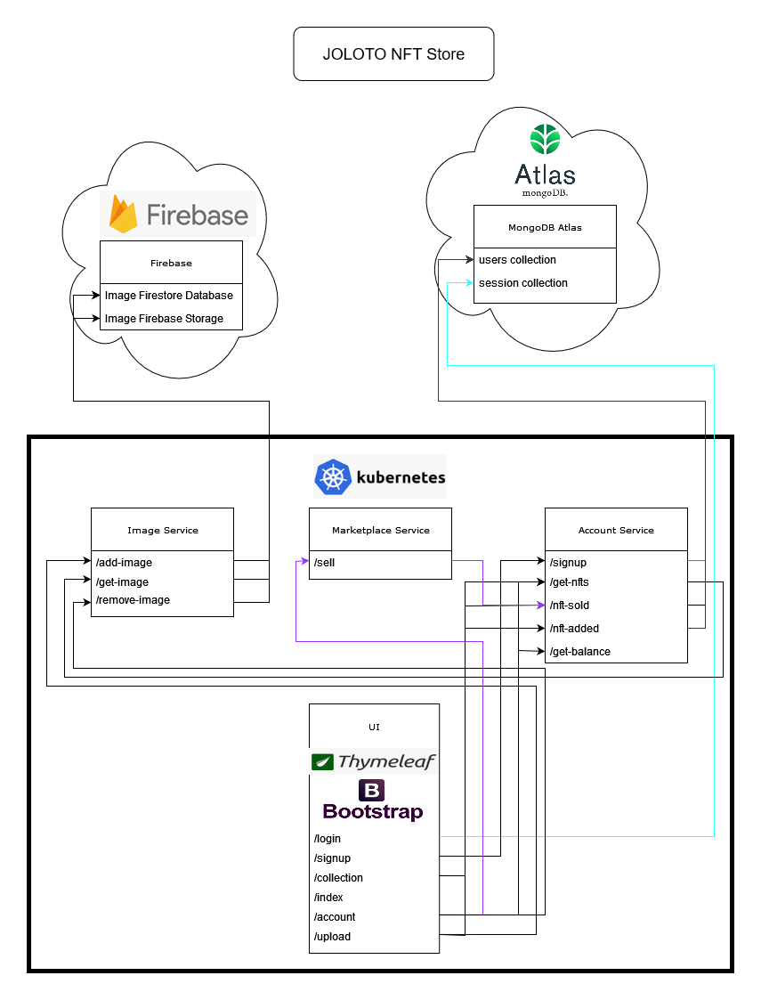

The JOLOTO NFT Store is a marketplace for Non-Fungible Tokens which have taken the world by storm in the past year with speculation driving the price of seemingly random digital artwork through the roof.

In response to this, we have decided to create our own “NFT Marketplace”, with a humorous twist. Users can login and upload their own images to the service, which then become NFTs on their account with a unique ID. They can then “sell” this NFT, which will return a randomised pay out. The pay outs are tailored so that the user will lose money in the long run.



Building an online store that can respond to high volumes of transactional traffic and data requires a distributed architecture which will allow components to scale independently as demanded by the load.
This architecture also makes the online store highly fault tolerant as multiple instances of each service can exist and receive requests through a load balancer. 

# Get Started
- The JOLOTO NFT Store is a distributed web application consisting of multiple services which are deployed using Kubernetes. 
- Required software:
    - Maven
    - Docker 
		- Docker Desktop on Windows used in this project
    - Kubernetes 
		- Kubernetes installed via Docker Desktop on Windows used in this project
    - Skaffold
        - Skaffold makes it easy to build the Docker images for the services, follow the deployment.yaml file and deploy the application to Kubernetes and when exiting the application it will tidy up all artefacts produced.
- Steps for setting up Kubernetes and Skaffold:
    1. Enable Kubernetes in the Docker Desktop settings
        - Settings -> Kubernetes -> Enable Kubernetes
    2. Install Skaffold and add it to the PATH
        - Available from [this](https://skaffold.dev/) website
- Steps for running Kubernetes locally after setup
    1. ``` mvn clean install ```
    2. Skaffold will deploy the application to Kubernetes. When Ctrl-C is pressed Skaffold will also delete the deployment on Kubernetes and tidy up all Docker images produced. 
        - ``` skaffold dev --no-prune=false --cache-artifacts=false ```
- The web app is accessible at http://localhost:30001/
- The default test account has credentials:
	- Username: joloto-user
	- Password: password 

# Project Design

We elected to design a system composed of services to help meet our requirements of scalability and fault tolerance. This section is expanded in great depth in our report which is also available in this repository.

We have 4 main services:
1. UI (User Interface)
2. Account Service
3. Marketplace Service
4. Image Service 



## UI 
The UI is composed of Spring, Thymeleaf & Bootstrap and is where a user interacts with the JOLOTO NFT Store.

The 6 main endpoints are:
- "/login"
    - Login to an existing account
- "/signup"
    - Sign up for an account
- "/collection"
    - A view of the NFTs owned by a user with the option to sell each of them
- "/index"
    - General landing page that introduces the NFT store
- "/account"
    - The current user balance and number of NFTs uploaded
- "/upload"
    - Uploading NFTs to the web app


## Account Service
The account service provides 5 REST endpoints for creating and modifying user account data.

The 5 endpoints are:
- "/signup"
	- Method = POST
	- Requires parameters: (String username, String password)
- "/get-nfts"
	- Method = GET
	- Requires parameters: (String username)
- "/nft-sold"
	- Method = POST
	- Requires parameters: (String username, String imageID, String amount)
- "/nft-added"
	- Method = POST
	- Requires parameters: (String username, String imageID)
- "/get-balance"
    - Method = GET
    - Requires parameters: (String username)

## Marketplace Service
The marketplace service provides a REST endpoint for calculating the result of selling an NFT.

The endpoint is:
- "/sell"
	- Method = GET
	- Required parameters: ()

## Image Service
The image service module offers REST endpoints for storing retrieving and deleting images and their titles.

The 3 endpoints are:
- "/add-image"
  - Method = POST
  - Requires parameters: (String title, MultipartFile image)
- "/get-image"
  - Method = GET
  - Requires parameters: (String id)
- "/remove-image"
  - Method = PUT
  - Requires parameters: (String id)

---

# Development

## UI Development Workflow
- We use the Spring Boot Devtools feature to allow:
    - Automatically application restarts when changes are made to the controllers.
	- The Live Reload server allows the Thymeleaf templates to be automatically reloaded in the browser.
- Steps:
    1. Start the UIApplication.java entrypoint to the UI Application
    2. Run the Chrome browser with the Live Reload extension

## Ports
- UI: 
    - Internal: 8080
	- External: 30001
- AccountService: 
    - Internal: 8081
- MarketplaceService: 
    - Internal: 8082
- ImageService: 
    - Internal: 8083

## Code Editor
- Visual Studio Code
    - Extensions
        - Lombok Annotations Support for VS Code
        - Maven for Java
        - Debugger for Java